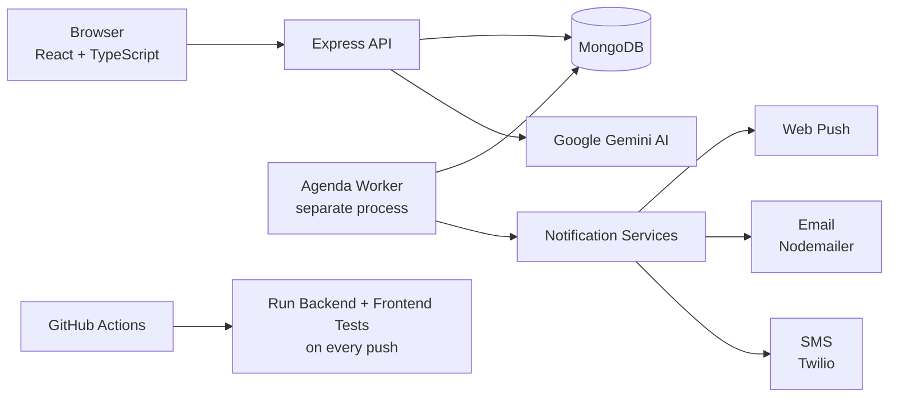

# 🏥 MedAlert — Smart Medicine Reminder & Stock Alert

[](https://github.com/Rishad010/MedAlert/actions/workflows/ci.yml)

> **Live Demo:** _Coming soon after deployment_

A full-stack MERN web application that helps users manage their medication schedules, track medicine stock levels, and receive timely reminders via push notifications, email, and SMS.

---

## 📋 Table of Contents
- [🧠 Project Overview](#project-overview)
- [🛠️ Tech Stack](#tech-stack)
- [🏗️ Architecture](#architecture)
- [✨ Features](#features)
- [📸 Screenshots](#screenshots)
- [📡 API Reference](#api-reference)
- [🚀 Local Setup](#local-setup)
- [🧪 Testing](#testing)
- [☁️ Deployment](#deployment)
- [👤 Author](#author)

---

## 🧠 Project Overview
Millions of people miss medicine doses because life gets busy, schedules become inconsistent, or reminders are easy to overlook. Many users also realize too late that their medicine stock is running low, which leads to skipped treatment and avoidable health risk.

MedAlert solves this with a complete medication management workflow: automated reminders, low-stock and expiry alerts, and a built-in AI assistant for quick medicine-related help. It combines adherence tracking with proactive notifications so users stay informed and consistent every day.

This project is designed for patients, caregivers, and anyone following a daily medication schedule. Whether managing one prescription or multiple family members, MedAlert provides a clear, reliable system for staying on track.

---

## 🛠️ Tech Stack

| Category | Technology | Purpose |
|---|---|---|
| Frontend | React 19, TypeScript, Vite, Tailwind CSS, React Query, Recharts | Fast SPA UI, typed components, state/query management, and data visualization |
| Backend | Node.js, Express 5, ESM | REST API, authentication, business logic, and modern module architecture |
| Database | MongoDB, Mongoose | Persistent storage for users, medicines, reminders, and pharmacy data |
| Jobs & Notifications | Agenda scheduler, Nodemailer, Twilio, Web Push | Scheduled reminders and multi-channel delivery (email, SMS, browser push) |
| Testing & CI | Jest, Supertest, Vitest, React Testing Library, GitHub Actions | Backend and frontend automated tests with CI checks on code changes |

---

## 🏗️ Architecture



---

## ✨ Features

**Auth**
- [x] JWT authentication
- [x] Role-based access (user/admin)
- [x] Protected routes

**Medicines**
- [x] Full CRUD
- [x] Medicine autocomplete
- [x] Expiry date tracking

**Reminders**
- [x] Agenda-powered scheduled reminders
- [x] Follow-up nudges for unacknowledged doses
- [x] Recurring daily scheduling

**Notifications**
- [x] Browser push (VAPID)
- [x] Email (Nodemailer/Gmail)
- [x] SMS (Twilio)
- [x] All channels toggleable per user

**Dashboard**
- [x] Adherence trend chart
- [x] Stock/expiry indicators
- [x] KPI cards

**AI Assistant**
- [x] Gemini-powered chat with medicine-specific tool actions
- [x] Streaming SSE responses

**Pharmacy**
- [x] Product catalog
- [x] Cart
- [x] Order placement
- [x] Admin order management with tracking

**DevOps**
- [x] GitHub Actions CI pipeline
- [x] Jest + Supertest backend tests
- [x] Vitest + RTL frontend tests

---

## 📸 Screenshots

| Landing Page | Dashboard |
|---|---|
| _Screenshot coming soon_ | _Screenshot coming soon_ |

| Add Medicine | AI Assistant |
|---|---|
| _Screenshot coming soon_ | _Screenshot coming soon_ |

> **Note:** Add screenshots by replacing the placeholder text with: `` after taking screenshots of the live app.

---

## 📡 API Reference

| Method | Endpoint | Auth Required | Description |
|---|---|---|---|
| POST | `/api/auth/register` | No | Register a new user account |
| POST | `/api/auth/login` | No | Log in and receive JWT token |
| GET | `/api/auth/me` | Yes | Fetch current authenticated user profile |
| PATCH | `/api/auth/profile` | Yes | Update user profile and notification preferences |
| GET | `/api/medicines/` | Yes | List medicines for logged-in user |
| POST | `/api/medicines/` | Yes | Create a new medicine entry |
| GET | `/api/medicines/:id` | Yes | Get a single medicine by ID (owner only) |
| PUT | `/api/medicines/:id` | Yes | Update a medicine by ID |
| DELETE | `/api/medicines/:id` | Yes | Delete a medicine by ID |
| POST | `/api/medicines/reschedule-reminders` | Yes | Rebuild all reminder jobs for the logged-in user |
| GET | `/api/dashboard/` | Yes | Fetch dashboard KPIs, trends, and adherence insights |
| GET | `/api/reminders/` | Yes | Fetch reminder logs/history |
| PUT | `/api/reminders/:id/acknowledge` | Yes | Mark a reminder as acknowledged/taken |
| GET | `/api/pharmacy/products` | Yes | Fetch pharmacy product catalog |
| POST | `/api/pharmacy/orders` | Yes | Place a new pharmacy order |
| GET | `/api/pharmacy/orders` | Yes (Admin) | List all pharmacy orders for admin management |
| PUT | `/api/pharmacy/orders/:id/status` | Yes (Admin) | Update pharmacy order status/tracking |
| POST | `/api/push/subscribe` | Yes | Save browser push subscription for user |
| DELETE | `/api/push/unsubscribe` | Yes | Remove browser push subscription |
| POST | `/api/assistant/chat` | Yes | Chat with AI assistant using streaming responses |

---

## 🚀 Local Setup

### Prerequisites
- Node.js 18+
- MongoDB (local or Atlas)
- Git

### Steps
1. Clone the repo.
2. Set up backend:
   - `cd backend`
   - Copy `.env.example` to `.env`
   - Fill in required values
   - `npm install`
   - `npm run seed` (optional)
3. Set up frontend:
   - `cd frontend`
   - Copy `.env.example` to `.env`
   - Fill in `VITE_API_URL=http://localhost:5000/api` and `VITE_VAPID_PUBLIC_KEY`
   - `npm install`
4. Run backend in two terminals:
   - `npm run dev`
   - `npm run dev:worker`
5. Run frontend:
   - `npm run dev`
6. Open `http://localhost:5173`

> **VAPID key generation:** `npx web-push generate-vapid-keys`

---

## 🧪 Testing

### Backend tests (Jest + Supertest)
```bash
cd backend
npm test
```

Covers: auth register/login/me routes with in-memory MongoDB via mongodb-memory-server

### Frontend tests (Vitest + React Testing Library)
```bash
cd frontend
npm test
```

Covers: Login component rendering and validation behaviour

### CI Pipeline
GitHub Actions runs both test suites automatically on every push and pull request to `main`.

See: [GitHub Actions](https://github.com/Rishad010/MedAlert/actions)

---

## ☁️ Deployment

### Backend → Render
1. Create a Web Service on [render.com](https://render.com).
2. Connect your GitHub repository.
3. Set:
   - Root Directory: `backend`
   - Build Command: `npm install`
   - Start Command: `npm start`
4. Add all environment variables from `backend/.env.example` using real production values.
5. Set `NODE_ENV=production`.

### Frontend → Vercel
1. Import the project on [vercel.com](https://vercel.com).
2. Set Root Directory to `frontend`.
3. Add `VITE_API_URL` pointing to your Render backend URL + `/api`.
4. Add `VITE_VAPID_PUBLIC_KEY`.
5. Deploy.

### Post-deployment
After both services are deployed, go back to Render and set `CLIENT_URL` to your Vercel frontend URL to enable CORS correctly.

---

## 👤 Author
Rishad | GitHub: Rishad010